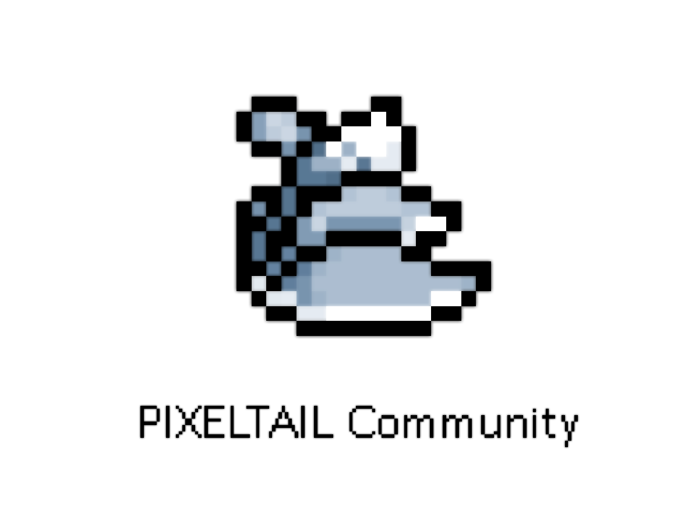

# PIXELTAIL-AutoLaunch

#### 介绍

为像素尾巴服务器新人制作的一键启动

#### 事情是这样的：

就大概23年六七月份的一段时间吧，那时候加入像素尾巴（一个MC服务器）的新人特别多，服务器需要外置登录，然后好多新人不会配置启动器，一个个教太麻烦了，所以我打算整个一键启动。

#### 更新日志

目前后端开发基本完成，你们的怨种Developer正在努力实现下载MC的功能，当然还有制作图形化界面（毕竟给新人一个CMD大黑框子操作好像不太直观XD）

#### 我们的理念

官方没有的，社区来做！

